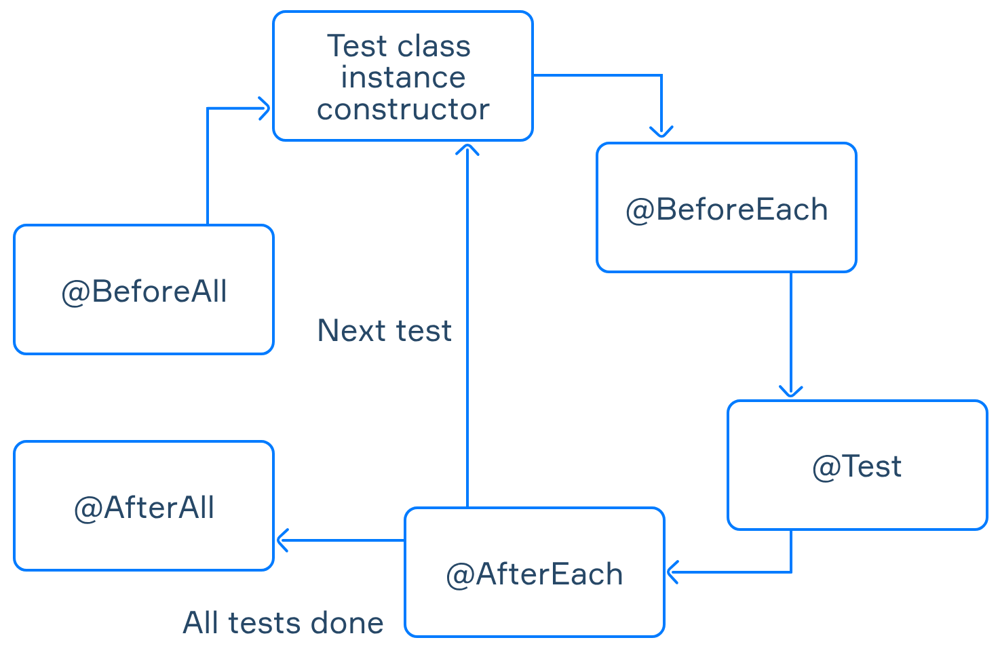
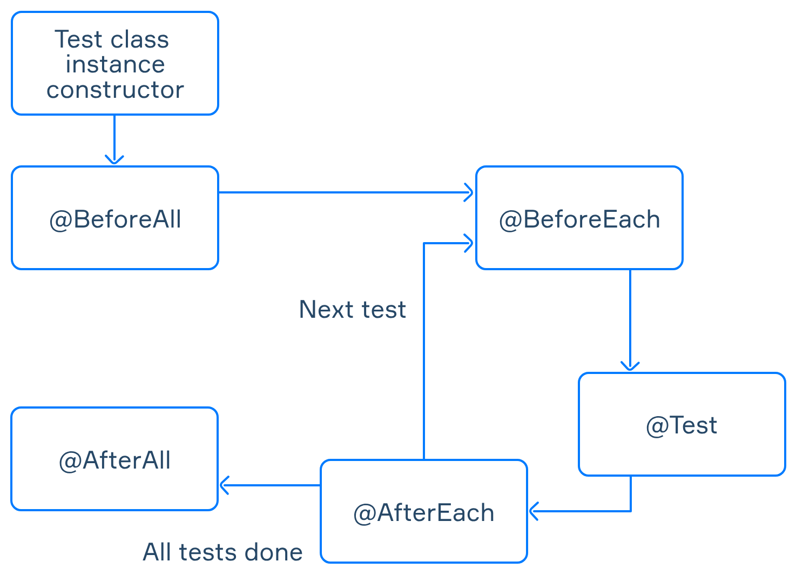

# Usage of available tools for testing in Java

* JUnit5 - class Calculator with tests (simple examples)
* Mockito - tests of FXConverter class to calculate FX rates. RemoteFXRatesService is mocked with Mockito (we assume it's an external library)
* JUnit5 - this time we'll implement more specific tests 
  * LifeCycleTest class to prove the below diagram (first one "PER_METHOD")
  * UserTest class proves lifeCycle again plus interesting case with @RepeatedTest

### LifeCycle diagram of tests clasess
* @TestInstance(TestInstance.Lifecycle.PER_METHOD)

* @TestInstance(TestInstance.Lifecycle.PER_CLASS)

